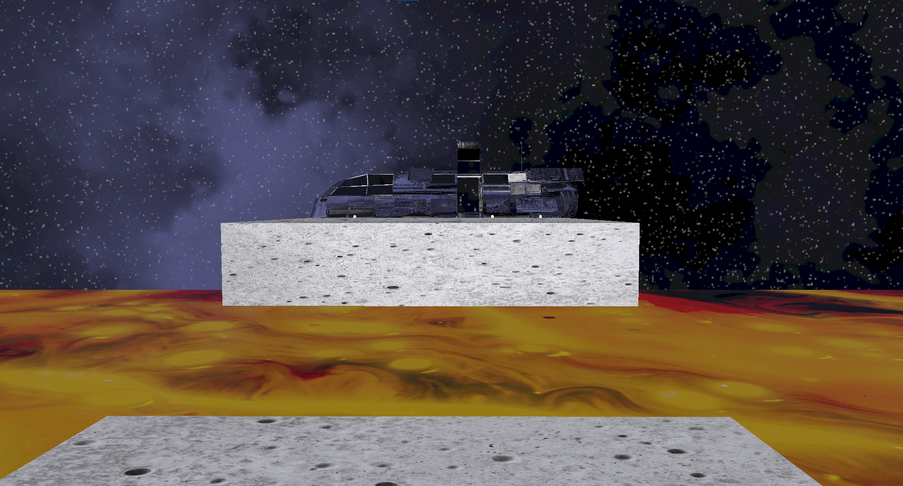
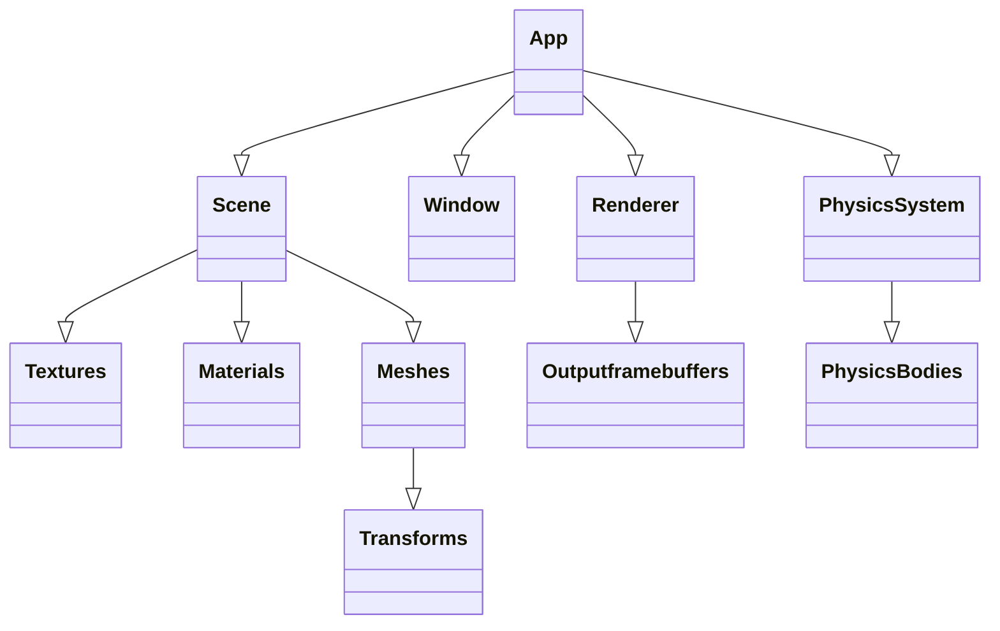
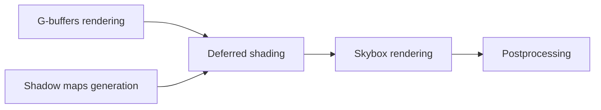
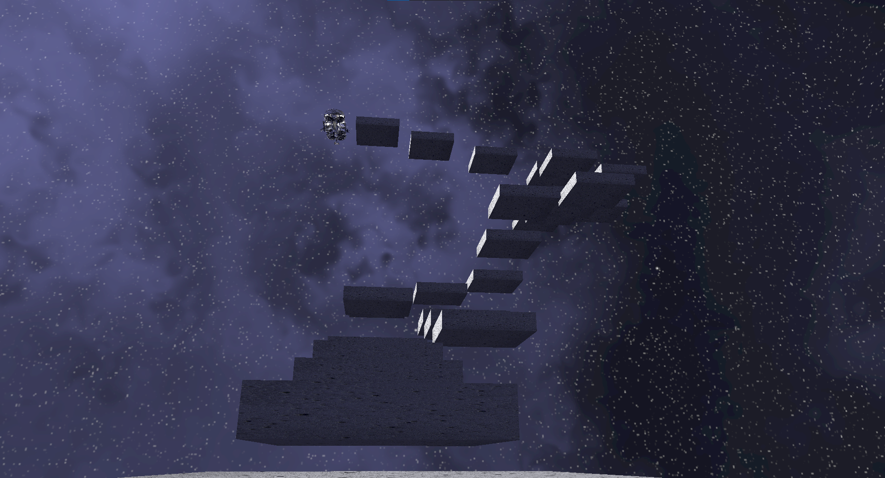
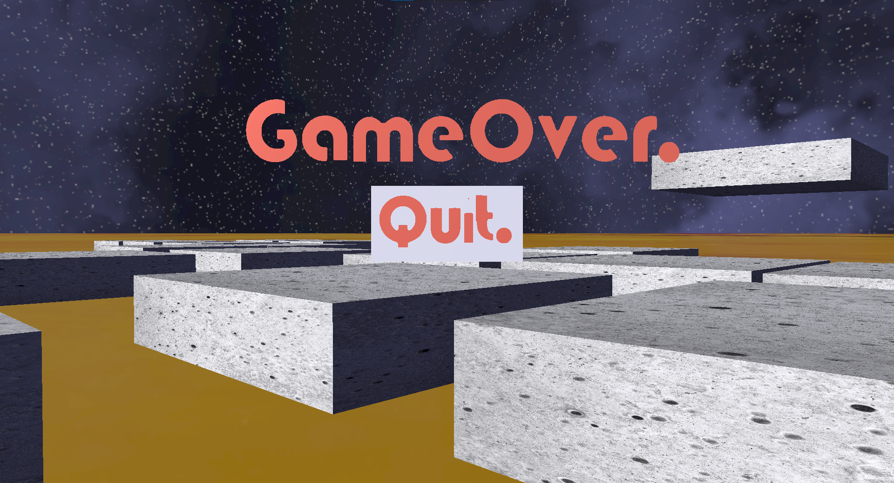

# Astronaut Game



A game made from scratch using C++ and OpenGL. With custom rendering framework and custom physics system.

## Features

Graphics:

• PBR

• Deferred shading

• Scene hierarchy

• Dynamic shadows

• Skinned meshes

• SDF text

• Postprocessing effects

Physics:

• Verlet integration

• SAT collision detection

• Simple air resistance

Audio:

• Spatial audio output

Additional:

• Event system

• Logging system

## System overview



## Rendering pipeline



## Prerequisites

Cmake 3.8 or higher

C++ standard used - c++ 23

## How to build

### Windows - Visual Studio

Open cmd.

Clone repo

```bash
git clone https://github.com/CodeForBeauty/AstronautGame
```

Open cloned repo folder

```bash
cd AstronautGame
```

Create build folder

```bash
mkdir build
```

Open buildfolder

```bash
cd build
```

Run cmake build

```bash
cmake build ..
```

Visual Studio project will be generated for default Visual Studio version on the system.

Primary executable is in the folder "app".

#### Controls:

  [WASD] - move
  
  [Space] - jump
  
  [Esc] = pause/unpause


## Limitations

No alpha blending

No UI rendering

Not accurate collision response

No particle system

No frustrum culling

No instanced rendering

Everything is single threaded

## What I learned

Using shared_ptr for everything is a bad idea. This creates an easy way to create objects, as there is no concrete owner of that object. 
However this adds considerable performance penalty, and adds unnesasery complexity. Also having one concrete owner makes it easy to see when that object will be created and when it will be destroyed.

Inputs should be handled seperately. In this game the inputs are handled by Window class through GLFW. This makes input detection easy, 
but makes Window class unclear on what it does.

Events are a great tool, but not the answer. In this project I've used Events in a lot of the places. While in some places this works great(like input handling), 
in others it creates unnesary complexity.

Seperate asset manager. In this project the Scene class handles asset loading and managing. This works fine for this small of a project, but for bigger projects asset management should be seperated.

Adding dependencies's code directly into project adds easy cross platform support, but increases build times considerably. It is better to precompile dependencies.

## Dependencies

glfw/glad - graphics api

openal/libsnd - audio api

imgui - debugging UI api

assimp - 3d model loading

stb_image - textures loading

freetype - font loading

## Media




